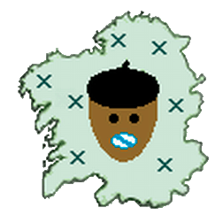

<link rel="stylesheet" href="css/estilo.css">

# INFORME CURSO 2021-2022

| Este é un sumario dos datos recollidos polos participantes no _Fitofaladoiro_ durante o curso 2021-2022.    Non se contabilizan os centros que non cubriron as súas táboas de recollida de datos nin compartiron os seus arquivos segundo o protocolo establecido. |  |
| :--- | --- |

  - [INFORME CURSO 2021-2022](#informe-curso-2021-2022)
    - [CPI Bormoio - Agualada, Coristanco (C. Coristanco)](#cpi-bormoio---agualada-coristanco-c-coristanco)
    - [CEIP de Cerdeiriñas (Po. Vila de Cruces)](#ceip-de-cerdeiriñas-po-vila-de-cruces)
    - [IES San Paio (Po. Tui)](#ies-san-paio-po-tui)
    - [CPI Caldelas de Tui (Po. Tui)](#cpi-caldelas-de-tui-po-tui)
    - [IES Escolas Proval (Po. Nigrán)](#ies-escolas-proval-po-nigrán)
    - [IES Escolas Proval (Po. Nigrán)](#ies-escolas-proval-po-nigrán-1)
    - [IES Escolas Proval (Po. Nigrán)](#ies-escolas-proval-po-nigrán-1)
    - [CEIP Plurilingüe de Cerdeiriñas (Po. Vila de Cruces)](#ceip-plurilingüe-de-cerdeiriñas-po-vila-de-cruces)
    - [IES Illa de Ons (Po. Bueu)](#ies-illa-de-ons-po-bueu)
    - [IES Illa de Ons (Po. Bueu)](#ies-illa-de-ons-po-bueu-1)

 

## <a href='http://fitofaladoiro.eu?fich=1lbdZxnZemQ5Guvu0FJxVhxO8hNoidFrCVOfjEgLAItQ'>CPI Bormoio - Agualada, Coristanco</a> (C. Coristanco)

### 476 PLANTAS mostreadas
 :herb: :deciduous_tree: :evergreen_tree: :palm_tree: :seedling: :tomato: :pear: :apple: :mushroom: 

_?_&nbsp;(476); 

### 476 ENQUISAS realizadas
 :notebook: :pencil2: :microphone: :older_man: :older_woman: :movie_camera: :question: :pencil: 

`?`&nbsp;(27); `A menta`&nbsp;(1); `Abeleiras`&nbsp;(1); `Abeneiros`&nbsp;(2); `Abeto`&nbsp;(1); `Acebo`&nbsp;(2); `acebo`&nbsp;(1); `Acebro`&nbsp;(1); `Acelgas`&nbsp;(1); `Acivro`&nbsp;(2); `Alcacia`&nbsp;(3); `Alcacias`&nbsp;(2); `Alcipreste`&nbsp;(3); `Alcolito`&nbsp;(1); `Alcolito novo`&nbsp;(1); `Aligustre`&nbsp;(1); `Amapola`&nbsp;(1); `Ameixeira`&nbsp;(1); `Arcipreste`&nbsp;(2); `Arruda`&nbsp;(1); `Azucenas`&nbsp;(1); `Baloca`&nbsp;(1); `Barbas de Millo`&nbsp;(1); `Bidueiro`&nbsp;(1); `Bonsai`&nbsp;(1); `Borraxa`&nbsp;(1); `bugallos`&nbsp;(1); `Buxo`&nbsp;(10); `Bévedo`&nbsp;(1); `Bólas`&nbsp;(1); `Bólas da carballo`&nbsp;(1); `Cabaza`&nbsp;(1); `Cactus`&nbsp;(2); `Cactus`&nbsp;(1); `Cala`&nbsp;(3); `Calas`&nbsp;(1); `Calístamo`&nbsp;(1); `Camelia`&nbsp;(6); `camelia`&nbsp;(1); `Camelia`&nbsp;(1); `Camelio`&nbsp;(1); `Campaniñas`&nbsp;(1); `Campía mexacáns`&nbsp;(1); `Canaveiras`&nbsp;(5); `Caqui`&nbsp;(1); `Caravel`&nbsp;(1); `Carballo`&nbsp;(4); `carballo`&nbsp;(1); `Carballos`&nbsp;(1); `Cardo`&nbsp;(4); `Cardo dulce`&nbsp;(1); `Cardo santo`&nbsp;(1); `cartucho`&nbsp;(1); `Cartucho`&nbsp;(1); `cartuchos`&nbsp;(1); `Castaño`&nbsp;(4); `Cebro`&nbsp;(2); `Cebro`&nbsp;(1); `Cedro (cebro)`&nbsp;(1); `Celedonia`&nbsp;(3); `Cencibre`&nbsp;(1); `Cerceno do Millo`&nbsp;(1); `Cheirón`&nbsp;(3); `Cheiróns`&nbsp;(1); `Chilra`&nbsp;(1); `Chopo branco`&nbsp;(1); `Chorón`&nbsp;(1); `Ciprés`&nbsp;(1); `Clementina`&nbsp;(1); `Col`&nbsp;(1); `Col de verza`&nbsp;(1); `Coleiro`&nbsp;(1); `Coleiro de verzas`&nbsp;(1); `Copo`&nbsp;(1); `Corneta`&nbsp;(1); `cornetas`&nbsp;(1); `Corouquelos`&nbsp;(1); `Corre que te pillo`&nbsp;(5); `Couselos`&nbsp;(1); `Crouquelo`&nbsp;(3); `Cuprosma`&nbsp;(1); `Dente de león`&nbsp;(4); `espada`&nbsp;(1); `Espadana`&nbsp;(3); `espadana`&nbsp;(1); `espadana`&nbsp;(1); `Espadanas`&nbsp;(2); `Espiño`&nbsp;(1); `Eucalipto`&nbsp;(3); `Eucaliptos`&nbsp;(2); `Eucalito`&nbsp;(2); `Fariñeiro`&nbsp;(1); `Fieita`&nbsp;(2); `Fieita arnal`&nbsp;(1); `Fieita real`&nbsp;(5); `Fieita seca`&nbsp;(1); `Fieitas`&nbsp;(4); `Fieitas secas`&nbsp;(2); `Fieito`&nbsp;(1); `Fieito real`&nbsp;(1); `Fieitos`&nbsp;(2); `Figheira sin follas`&nbsp;(1); `Figueira`&nbsp;(3); `Figueira`&nbsp;(1); `Fiuncho`&nbsp;(1); `Fiúncho`&nbsp;(5); `Flor de Pascua`&nbsp;(1); `flor do Paraiso`&nbsp;(1); `Folla de camelia`&nbsp;(1); `Folla de carballo`&nbsp;(1); `Folla de liquidámbar`&nbsp;(1); `Folla de malva`&nbsp;(2); `Folla de millo`&nbsp;(1); `Folla de trevo`&nbsp;(1); `Follas de loureiro`&nbsp;(1); `Follas de oliveira`&nbsp;(1); `Follas do Nogal`&nbsp;(1); `Frambuesas`&nbsp;(1); `Galán`&nbsp;(2); `galán`&nbsp;(1); `Hedra`&nbsp;(8); `Hedra`&nbsp;(1); `Hedras`&nbsp;(5); `Herba`&nbsp;(1); `Herba campía`&nbsp;(1); `Herba da fístula`&nbsp;(1); `Herba da pulga`&nbsp;(1); `Herba Luísa`&nbsp;(1); `Herba trigheira`&nbsp;(1); `Hortensia`&nbsp;(3); `Hortensia`&nbsp;(1); `Hortensias`&nbsp;(2); `Irtos salvaxes`&nbsp;(1); `Kivi`&nbsp;(1); `Kiwi`&nbsp;(1); `Labaza`&nbsp;(1); `Labazas`&nbsp;(3); `Laranxeira`&nbsp;(2); `Laranxo`&nbsp;(1); `Leituga`&nbsp;(2); `leituga`&nbsp;(1); `Letospermo`&nbsp;(1); `Limoeiro`&nbsp;(5); `Limpabotellas`&nbsp;(1); `Lombarda`&nbsp;(1); `Loureiro`&nbsp;(7); `loureiro`&nbsp;(2); `loureiro`&nbsp;(1); `Loureiro real`&nbsp;(6); `loureiro real`&nbsp;(1); `Loureiros`&nbsp;(3); `lágrimas de San Pedro`&nbsp;(1); `Maceira`&nbsp;(1); `Maceira`&nbsp;(1); `Madreselva`&nbsp;(1); `Magnolio`&nbsp;(2); `Malva`&nbsp;(3); `malva`&nbsp;(1); `Malvón`&nbsp;(1); `Maracullá`&nbsp;(1); `Margarita`&nbsp;(2); `Margarita silvestre`&nbsp;(1); `Margaritas`&nbsp;(1); `Margharitas`&nbsp;(1); `Maruxa`&nbsp;(6); `Mazanceira`&nbsp;(1); `Mazanceiras`&nbsp;(2); `Menta`&nbsp;(1); `Mimosa`&nbsp;(1); `Mimosas`&nbsp;(2); `Mirto`&nbsp;(2); `Mirtos`&nbsp;(3); `Morceñas`&nbsp;(1); `Musgho`&nbsp;(1); `Musgo`&nbsp;(5); `Nabizas`&nbsp;(1); `Nadantes`&nbsp;(1); `Nandina`&nbsp;(1); `Nispareiro`&nbsp;(1); `Nogal`&nbsp;(1); `Nébeda`&nbsp;(1); `Nébedas`&nbsp;(2); `Níspero`&nbsp;(1); `oliva`&nbsp;(1); `Oliveira`&nbsp;(8); `oliveira`&nbsp;(2); `Ortiga`&nbsp;(4); `Ortiga`&nbsp;(1); `Ortigas`&nbsp;(4); `Paletas`&nbsp;(1); `Palmeira`&nbsp;(1); `Palmera`&nbsp;(4); `palmera`&nbsp;(1); `Papeleta`&nbsp;(1); `Papeletas`&nbsp;(1); `Parra`&nbsp;(1); `Pelindroque`&nbsp;(1); `Pelitroques`&nbsp;(1); `Pensamento`&nbsp;(1); `Pensamentos`&nbsp;(1); `Peregil`&nbsp;(1); `Pereira`&nbsp;(1); `Pexegheiro`&nbsp;(1); `Pimentos rojos`&nbsp;(1); `Pino`&nbsp;(7); `pino`&nbsp;(1); `Pino cernil`&nbsp;(2); `pino cernil`&nbsp;(1); `Pino de fóra`&nbsp;(1); `Pirxel`&nbsp;(1); `Piñeiro`&nbsp;(1); `Plumachos`&nbsp;(1); `Potimia`&nbsp;(1); `Pouta`&nbsp;(1); `Prixel`&nbsp;(1); `Puerros`&nbsp;(1); `Póla de carballo`&nbsp;(1); `Póla do rosal`&nbsp;(1); `Queiroa`&nbsp;(1); `Queiroas`&nbsp;(3); `Rabizas`&nbsp;(1); `Regnum`&nbsp;(1); `Rododendro`&nbsp;(1); `Romeo`&nbsp;(1); `Romero`&nbsp;(2); `Romeu`&nbsp;(1); `Rosa`&nbsp;(2); `Rosal`&nbsp;(1); `Roseira`&nbsp;(1); `Ruda`&nbsp;(2); `Salgueiro`&nbsp;(1); `Salvia`&nbsp;(1); `Santa María`&nbsp;(1); `Saramago`&nbsp;(2); `sebe`&nbsp;(1); `Sedre`&nbsp;(1); `Setas`&nbsp;(1); `Silva`&nbsp;(2); `Silvas`&nbsp;(7); `Silveira`&nbsp;(1); `Texo`&nbsp;(1); `texo`&nbsp;(1); `Toxo`&nbsp;(9); `toxo`&nbsp;(1); `Toxos`&nbsp;(1); `Toxos con flores`&nbsp;(1); `Trevisco`&nbsp;(1); `Trevo`&nbsp;(1); `Trevos`&nbsp;(1); `Trompeta branca`&nbsp;(1); `Trompetas amarelas`&nbsp;(1); `tronco brasileño`&nbsp;(1); `Tronco de carballo`&nbsp;(1); `Trébol`&nbsp;(1); `Tuia`&nbsp;(4); `Tullas`&nbsp;(1); `Té silvestre`&nbsp;(1); `Uces`&nbsp;(1); `Verzas`&nbsp;(1); `Xaponeseiro`&nbsp;(1); `Xeno de repolo`&nbsp;(1); `Xenos`&nbsp;(1); `Xeranio`&nbsp;(1); `Xesta`&nbsp;(6); `Xestas`&nbsp;(5); `xestas`&nbsp;(1); `Xilbarbeira`&nbsp;(1); `Xuncos`&nbsp;(2); `¿CHUCHAMELES`&nbsp;(1); 
#### Datos procedentes de 2 concellos:

C. Coristanco&nbsp;(397); C. Cabana&nbsp;(89); 

### <a href='https://drive.google.com/drive/folders/1W72g37SNIoRf61gLeqUvo-QFQQ6lT2_o'>482</a> ARQUIVOS complementan o traballo
 :file_cabinet: :open_file_folder: :floppy_disk: 

- imaxe: 482 :camera: 

### 6 RECURSOS WEB relacionados
 :link: 

- Coordinación: Evaristo Domínguez Rial
- Fraseoloxía e paremioloxía de Bergantiños (Cabana de Bergantiños, Carballo e Coristanco): Recadádiva de fraseoloxía e paremioloxía galega realizada no cambio de milenio na Terra de Bergantiños, no NO de Galicia. Resultado da colaboración de avós e avoas, pais, nais e fillos co equipo de mestres e co Centro Ramón Piñeiro para a Investigación en Humanidades
http://www.cirp.es/pub/docs/cfg/cfg13_14.pdf
- Cantigas de pobos: Retallos de cultura popular: Cantigas de pobos. Recompiladas por Evaristo Domínguez Rial
http://www.edu.xunta.gal/centros/ceipdebormoioagualada/system/files/CANTIGAS+DE+POBOS+RECOLLIDAS+NA+ZONA+DE+AGUALADA_1.pdf
- Microtoponimia das fincas da zona de influencia do CEIP Bormoio-Agualada: http://www.edu.xunta.gal/centros/ceipdebormoioagualada/system/files/MICROTOPONIMIA+DAS+FINCAS+DA+ZONA+DE+AGUALADA.pdf
- Traballos de Normalización "Recompilación Etnográfica" e "Cantigas Populares": 2009. Aquí tedes un extenso traballo coordinado polo noso Equipo de Normalización e Dinamización Lingüística. Consiste nunha recompilación etnográfica e outra recompilación con máis de 750 cantigas populares.
http://www.edu.xunta.gal/centros/ceipdebormoioagualada/node/53
- Datos sobre nomes de plantas recollidos polo alumnado do centro: Domínguez Rial, E. & al. (2014). Fitofaladoiro CEIP Bormoio - Agualada (Coristanco, A Coruña) [Data set]. Zenodo. http://doi.org/10.5281/zenodo.4545706

 

## <a href='http://fitofaladoiro.eu?fich=1QmuIIYRCWjt7RqyR4o32rRV4ful-lsnQFno5frfLsjo'>CEIP de Cerdeiriñas</a> (Po. Vila de Cruces)

### 63 PLANTAS mostreadas
 :herb: :deciduous_tree: :evergreen_tree: :palm_tree: :seedling: :tomato: :pear: :apple: :mushroom: 

_?_&nbsp;(63); 

### 64 ENQUISAS realizadas
 :notebook: :pencil2: :microphone: :older_man: :older_woman: :movie_camera: :question: :pencil: 

`?`&nbsp;(1); `Acebro`&nbsp;(1); `Acevo`&nbsp;(2); `Apio Bravo`&nbsp;(2); `Asentes`&nbsp;(3); `Camelia Blanca`&nbsp;(1); `Carballo`&nbsp;(1); `Castiñeiro`&nbsp;(1); `Celidonia`&nbsp;(1); `ciridonea`&nbsp;(1); `Ciridonia`&nbsp;(2); `Couchelos`&nbsp;(1); `Dente de león`&nbsp;(1); `Erva Luisa`&nbsp;(1); `Fento`&nbsp;(2); `Fiollo ou planta do anís`&nbsp;(1); `Fiuncho`&nbsp;(1); `Hedra`&nbsp;(1); `Herba buena`&nbsp;(1); `Herba Luisa`&nbsp;(1); `Jazmín de Carolina`&nbsp;(1); `Labanda`&nbsp;(1); `Lavanda`&nbsp;(1); `Lengua de ovella`&nbsp;(1); `Limoeiro`&nbsp;(1); `Loureiro ou lourel`&nbsp;(1); `Malba`&nbsp;(2); `Malva ou Malvarisco`&nbsp;(1); `Margarita`&nbsp;(1); `Membrilleiro`&nbsp;(1); `Menta`&nbsp;(1); `Mentraste`&nbsp;(1); `Milenrama ou mielenrama`&nbsp;(1); `Morillón`&nbsp;(1); `Nébeda`&nbsp;(1); `Oliveira`&nbsp;(1); `Ombligo de Venus`&nbsp;(1); `Ortensia`&nbsp;(1); `Orégano`&nbsp;(1); `Pirixel`&nbsp;(1); `Piñeiro`&nbsp;(1); `Romeo`&nbsp;(4); `Romeu`&nbsp;(1); `Rosa`&nbsp;(1); `Rosal`&nbsp;(1); `Sabugueiro`&nbsp;(1); `Salvia ou Xarxa`&nbsp;(1); `Silva`&nbsp;(1); `Soá`&nbsp;(1); `Trebol`&nbsp;(1); `Trevo`&nbsp;(1); `Trébol`&nbsp;(1); `Tulla`&nbsp;(1); `Xesta`&nbsp;(1); 
#### Datos procedentes de 3 concellos:

Po. Vila de Cruces&nbsp;(55); Po. Lalín&nbsp;(8); &nbsp;(1); 

### <a href='https://drive.google.com/drive/folders/'>87</a> ARQUIVOS complementan o traballo
 :file_cabinet: :open_file_folder: :floppy_disk: 

- imaxe: 67 :camera: 
- outros: 21 :notebook: :question: 
- : 1 :notebook: :question: 

### 4 RECURSOS WEB relacionados
 :link: 

- Fitofaladoiro 2016-2017:: Unhas poucas imaxes do noso traballo durante o curso 2016-2017: http://cerdeirinhas.blogspot.com.es/2017/02/blog-post_10.html
- Fitofaladoiro 2017-2018:: Imaxes do curso 2017-2018: https://fitofaladoirocerdeirinhas.blogspot.com/
- Fitofaladoiro 2018-2019: Acceso ás imaxes:  https://fitofaladoirocerdeirinhas.blogspot.com/
- Fitofaladoiro 2018-2019: Páxina principal: https://cerdeirinhas.wixsite.com/fitofaladoiro
- Fitofaladoiro todos os anos (incluído curso 2020-2021):: https://cerdeirinhas.wixsite.com/fitofaladoiro/as-nosas-imaxes

 

## <a href='http://fitofaladoiro.eu?fich=1UnZEXawyEb89WLkclf9oT92mDrnk6ZqZeQAk5qvjxMM'>IES San Paio</a> (Po. Tui)

### 70 PLANTAS mostreadas
 :herb: :deciduous_tree: :evergreen_tree: :palm_tree: :seedling: :tomato: :pear: :apple: :mushroom: 

_?_&nbsp;(10); _Alnus glutinosa_&nbsp;(3); _Arnica montana_&nbsp;(5); _Bellis perennis L. ?_&nbsp;(2); _bellis perennis L. ?_&nbsp;(1); _Castanea sativa_&nbsp;(2); _Chamaespartium tridentatum_&nbsp;(3); _Chelidonium majus_&nbsp;(3); _Digitalis purpurea L._&nbsp;(3); _Foeniculum vulgare_&nbsp;(7); _Hedera helix_&nbsp;(5); _Ilex aquifolium_&nbsp;(5); _Origanum vulgare_&nbsp;(4); _Plantago lanceolata_&nbsp;(3); _Pteridium aquilinum/ Polypodium sp.?_&nbsp;(5); _Umbilicus pendulinus_&nbsp;(4); _Urtica dioica L., Urtica urens L._&nbsp;(5); 

### 67 ENQUISAS realizadas
 :notebook: :pencil2: :microphone: :older_man: :older_woman: :movie_camera: :question: :pencil: 

`aceviño`&nbsp;(1); `acevo`&nbsp;(1); `acevro`&nbsp;(1); `acivro`&nbsp;(2); `airoghes`&nbsp;(1); `amieiro`&nbsp;(2); `amieiro manso`&nbsp;(1); `areiras`&nbsp;(1); `arnica`&nbsp;(3); `bilitroque`&nbsp;(1); `carqueixa`&nbsp;(3); `castiñeiro`&nbsp;(2); `celedonia`&nbsp;(2); `celidonia`&nbsp;(1); `ceruda`&nbsp;(1); `consellos`&nbsp;(1); `cousellos`&nbsp;(1); `couselo`&nbsp;(2); `croque branco`&nbsp;(1); `croques`&nbsp;(2); `estrugas`&nbsp;(3); `eurogues`&nbsp;(1); `feito`&nbsp;(2); `fento`&nbsp;(3); `fiuncho`&nbsp;(4); `fruncho`&nbsp;(1); `funcho`&nbsp;(2); `hedra`&nbsp;(3); `hedreira`&nbsp;(1); `hortelán`&nbsp;(5); `lingoreta`&nbsp;(1); `lingua de ovella`&nbsp;(2); `ortiga`&nbsp;(1); `ortigas`&nbsp;(1); `ourego`&nbsp;(2); `pampullo`&nbsp;(2); `troque manso`&nbsp;(1); `urtiga verde`&nbsp;(1); `árnica`&nbsp;(2); 
#### Datos procedentes de 7 concellos:

Po. Tui&nbsp;(43); Po. Tomiño&nbsp;(9); Po. Salceda de Caselas&nbsp;(6); Po. Porriño, O&nbsp;(5); Po. Gondomar&nbsp;(2); Po. Arbo&nbsp;(2); Po. Guarda, A&nbsp;(1); 

### <a href='https://drive.google.com/drive/folders/'>12</a> ARQUIVOS complementan o traballo
 :file_cabinet: :open_file_folder: :floppy_disk: 

- : 8 :notebook: :question: 
- imaxe: 6 :camera: 

### 11 RECURSOS WEB relacionados
 :link: 

- Galería de imaxes do Fitofaladoiro no IES San Paio: http://www.edu.xunta.gal/centros/iessanpaio/galeria/thumbnails.php?album=89
- mapa dialectal: Coas variantes encontradas dalgunhas plantas elaboramos un mapa dialectal da zona. Pódese ver na exposición que fixemos das plantas porque é un centro con alumnos de concellos diferentes e con informantes desde Arbo ata a Guarda 
http://www.edu.xunta.gal/centros/iessanpaio/galeria/displayimage.php?album=89&pos=15
- Cantigas con nomes de plantas: http://www.edu.xunta.gal/centros/iessanpaio/galeria/displayimage.php?pid=2756&fullsize=1
- Refráns con nomes de plantas: http://www.edu.xunta.gal/centros/iessanpaio/galeria/displayimage.php?album=89&pos=22
- celidonia: Temos unha planta seca sen raíz e sementes, só follas e flor no HBM San Paio Celidonia. Por ter que facelo antes do verán. 
http://www.edu.xunta.gal/centros/iessanpaio/galeria/displayimage.php?album=89&pos=1  
http://www.edu.xunta.gal/centros/iessanpaio/galeria/displayimage.php?album=89&pos=9

- fento: http://www.edu.xunta.gal/centros/iessanpaio/galeria/displayimage.php?album=89&pos=2
- fincho, funcho, fruncho: Temos un exemplar seco no HBM San Paio fiuncho. Recollemos tres variantes: fiuncho, funcho e fruncho.
http://www.edu.xunta.gal/centros/iessanpaio/galeria/displayimage.php?album=89&pos=18
- hedra: Temos un exemplar seco no HBM San Paio hedra, sen as bagas porque aínda non era tempo.
http://www.edu.xunta.gal/centros/iessanpaio/galeria/displayimage.php?album=89&pos=20
- lingua de ovella: Temos un exemplar seco no HBM San Paio lingua de ovella.
http://www.edu.xunta.gal/centros/iessanpaio/galeria/displayimage.php?album=89&pos=12
- ourego: Temos un exemplar seco sen flores no HBM San Paio ourego. Rexistramos varias variantes que localizamos no mapa dialectal.
- pampullo: Témolo recollido co nome de pampullo en toda a zona do Baixo Miño.
http://www.edu.xunta.gal/centros/iessanpaio/galeria/displayimage.php?album=89&pos=17

 

## <a href='http://fitofaladoiro.eu?fich=1hfh0oaP6OUEs2rhAz31PEXsdMPbaGiCMulhEyqiS8iM'>CPI Caldelas de Tui</a> (Po. Tui)

### 12 PLANTAS mostreadas
 :herb: :deciduous_tree: :evergreen_tree: :palm_tree: :seedling: :tomato: :pear: :apple: :mushroom: 

_Pinus pinaster_&nbsp;(12); 

### 12 ENQUISAS realizadas
 :notebook: :pencil2: :microphone: :older_man: :older_woman: :movie_camera: :question: :pencil: 

`bullo`&nbsp;(1); `candea`&nbsp;(1); `cisco`&nbsp;(1); `fasco`&nbsp;(1); `fiuma`&nbsp;(1); `fruma`&nbsp;(1); `garuma`&nbsp;(1); `maravalla`&nbsp;(1); `marruxo`&nbsp;(1); `palluzos`&nbsp;(1); `pico`&nbsp;(2); `pinocha`&nbsp;(1); 
#### Datos procedentes de 6 concellos:

Po. Tui&nbsp;(7); Po. Salceda de Caselas&nbsp;(2); C. Rianxo&nbsp;(1); Ou. Ourense&nbsp;(1); Po. Guarda, A&nbsp;(1); Po. Neves, As&nbsp;(1); 

 

## <a href='http://fitofaladoiro.eu?fich=1R6qcrH8nH23rtTrGfsdlsXP4ldiHlXTa4hor9TlYdhE'>IES Escolas Proval</a> (Po. Nigrán)

### 43 PLANTAS mostreadas
 :herb: :deciduous_tree: :evergreen_tree: :palm_tree: :seedling: :tomato: :pear: :apple: :mushroom: 

_ALOE VERA/ALOE BARBADENSIS_&nbsp;(1); _ALOYSIA CITRODORA_&nbsp;(8); _CHAMAEMELUM NOBILE_&nbsp;(2); _EUCALIPTUS GLOBULUS_&nbsp;(2); _HYPERICUM PERFORATUM_&nbsp;(1); _LAURUS NOBILIS_&nbsp;(3); _LAVANDULA ANGUSTIFOLIA_&nbsp;(4); _MENTHA SPITACA_&nbsp;(4); _OLEA EUROPAEA_&nbsp;(1); _PETROSELINUM CRISPUM/SATIVUM_&nbsp;(4); _ROSMARINUS OFFICINALIS/SALVIA ROSMARINUS_&nbsp;(10); _RUBUS ULMIFOLIUS SCHOTT_&nbsp;(1); _RUTA CHALAPENSIS_&nbsp;(1); _SALVIA OFFICINALIS_&nbsp;(1); 

### <a href='https://drive.google.com/drive/folders/1tE4t6kl2yod0UYPuqx3DsKCbNqYJsUpN'>1</a> ARQUIVOS complementan o traballo
 :file_cabinet: :open_file_folder: :floppy_disk: 

- : 6 :notebook: :question: 

 

## <a href='http://fitofaladoiro.eu?fich=1Y9hG1gX7aDZDw4sC10kRmfQiKs8ZwsC7kF_sFOd5w60'>IES Escolas Proval</a> (Po. Nigrán)

### 8 PLANTAS mostreadas
 :herb: :deciduous_tree: :evergreen_tree: :palm_tree: :seedling: :tomato: :pear: :apple: :mushroom: 

_?_&nbsp;(6); _Pinus pinea_&nbsp;(1); _Triticum_&nbsp;(1); 

### 42 ENQUISAS realizadas
 :notebook: :pencil2: :microphone: :older_man: :older_woman: :movie_camera: :question: :pencil: 

`a carrasca`&nbsp;(3); `a ceboleira`&nbsp;(1); `a pereira`&nbsp;(1); `a seara`&nbsp;(1); `a veiga`&nbsp;(1); `as cabazas`&nbsp;(2); `as carballas`&nbsp;(2); `camiño carballal`&nbsp;(1); `Camiño Das Bouzas Trigas`&nbsp;(1); `camiño das carballas`&nbsp;(1); `camiño das leiras`&nbsp;(1); `camiño das mimosas`&nbsp;(1); `camiño do fabal`&nbsp;(1); `camiño do pino manso`&nbsp;(1); `camiño piñeiros`&nbsp;(1); `carballal`&nbsp;(1); `carballeira`&nbsp;(1); `carballo da manadela`&nbsp;(1); `cerdeiras`&nbsp;(1); `estripeiro`&nbsp;(1); `fraga da oliveira`&nbsp;(1); `lourido`&nbsp;(1); `o loureiral`&nbsp;(1); `o maceiral`&nbsp;(1); `o salgueiral`&nbsp;(1); `o xuncal`&nbsp;(1); `os arieiros`&nbsp;(1); `panasco`&nbsp;(1); `piñeiro`&nbsp;(1); `praza da carrasca`&nbsp;(1); `rúa do rosal`&nbsp;(1); `rúa pereira`&nbsp;(1); `rúa souto`&nbsp;(1); `salgueiro`&nbsp;(1); `sobreira`&nbsp;(1); `soutomaior`&nbsp;(1); `tomada`&nbsp;(1); `xunqueira`&nbsp;(1); 
#### Datos procedentes de 6 concellos:

Po. Nigrán&nbsp;(26); Po. Baiona&nbsp;(7); Po. Gondomar&nbsp;(5); Po. Vigo&nbsp;(2); Lu. Valadouro, O&nbsp;(1); Po. Soutomaior&nbsp;(1); 

### <a href='https://drive.google.com/drive/folders/10cUlzhSD1hoyQ7ad6xZ4DairpefianeC'>1</a> ARQUIVOS complementan o traballo
 :file_cabinet: :open_file_folder: :floppy_disk: 

- : 170 :notebook: :question: 

 

## <a href='http://fitofaladoiro.eu?fich=1kNu2wLO4RkwzkR7Reu8k9OD0iGUAbBb-oXZ04tl22SY'>IES Escolas Proval</a> (Po. Nigrán)

### 8 PLANTAS mostreadas
 :herb: :deciduous_tree: :evergreen_tree: :palm_tree: :seedling: :tomato: :pear: :apple: :mushroom: 

_?_&nbsp;(6); _Pinus pinea_&nbsp;(1); _Triticum_&nbsp;(1); 

### 42 ENQUISAS realizadas
 :notebook: :pencil2: :microphone: :older_man: :older_woman: :movie_camera: :question: :pencil: 

`a carrasca`&nbsp;(3); `a ceboleira`&nbsp;(1); `a pereira`&nbsp;(1); `a seara`&nbsp;(1); `a veiga`&nbsp;(1); `as cabazas`&nbsp;(2); `as carballas`&nbsp;(2); `camiño carballal`&nbsp;(1); `Camiño Das Bouzas Trigas`&nbsp;(1); `camiño das carballas`&nbsp;(1); `camiño das leiras`&nbsp;(1); `camiño das mimosas`&nbsp;(1); `camiño do fabal`&nbsp;(1); `camiño do pino manso`&nbsp;(1); `camiño piñeiros`&nbsp;(1); `carballal`&nbsp;(1); `carballeira`&nbsp;(1); `carballo da manadela`&nbsp;(1); `cerdeiras`&nbsp;(1); `estripeiro`&nbsp;(1); `fraga da oliveira`&nbsp;(1); `lourido`&nbsp;(1); `o loureiral`&nbsp;(1); `o maceiral`&nbsp;(1); `o salgueiral`&nbsp;(1); `o xuncal`&nbsp;(1); `os arieiros`&nbsp;(1); `panasco`&nbsp;(1); `piñeiro`&nbsp;(1); `praza da carrasca`&nbsp;(1); `rúa do rosal`&nbsp;(1); `rúa pereira`&nbsp;(1); `rúa souto`&nbsp;(1); `salgueiro`&nbsp;(1); `sobreira`&nbsp;(1); `soutomaior`&nbsp;(1); `tomada`&nbsp;(1); `xunqueira`&nbsp;(1); 
#### Datos procedentes de 6 concellos:

Po. Nigrán&nbsp;(26); Po. Baiona&nbsp;(7); Po. Gondomar&nbsp;(5); Po. Vigo&nbsp;(2); Lu. Valadouro, O&nbsp;(1); Po. Soutomaior&nbsp;(1); 

### <a href='https://drive.google.com/drive/folders/'>1</a> ARQUIVOS complementan o traballo
 :file_cabinet: :open_file_folder: :floppy_disk: 

- : 170 :notebook: :question: 

### 1 RECURSOS WEB relacionados
 :link: 

- Blog no que se recolle a información obtida e as actividades realizadas para este proxecto: Ligazón pendente

 

## <a href='http://fitofaladoiro.eu?fich=1gY9B2kOUpkcbPvGbTKZLPKg8UZE5uisSpbttnv_sV3s'>CEIP Plurilingüe de Cerdeiriñas</a> (Po. Vila de Cruces)

 

## <a href='http://fitofaladoiro.eu?fich=12ejm7IFw5ItM57N0rmbfdWP0mjxlOrkaQ128UjOf8bo'>IES Illa de Ons</a> (Po. Bueu)

### 35 PLANTAS mostreadas
 :herb: :deciduous_tree: :evergreen_tree: :palm_tree: :seedling: :tomato: :pear: :apple: :mushroom: 

_Aloysia citrodora_&nbsp;(1); _Chelidonium majus_&nbsp;(2); _Foeniculum vulgare_&nbsp;(2); _Fucus sp._&nbsp;(1); _Helichrysum foetidum_&nbsp;(1); _Iris pseudacorus_&nbsp;(1); _Laminaria sp._&nbsp;(1); _Laurus nobilis_&nbsp;(3); _Lavandula_&nbsp;(1); _Lippia citriodora_&nbsp;(1); _Malva sp._&nbsp;(1); _Malva sylvestris_&nbsp;(1); _Mentha sp._&nbsp;(1); _Mentha suaveolens_&nbsp;(3); _Ocimum basilicum_&nbsp;(1); _Pisum sativum_&nbsp;(2); _Rosa sp._&nbsp;(1); _Ruta chalepensis_&nbsp;(2); _Saccorhiza polyschides_&nbsp;(1); _Salvia rosmarinus_&nbsp;(1); _Sambucus nigra_&nbsp;(2); _Ulex europaeus_&nbsp;(1); _Urtica dioica_&nbsp;(1); _Urtica sp._&nbsp;(2); _Zea mays_&nbsp;(2); 

### 65 ENQUISAS realizadas
 :notebook: :pencil2: :microphone: :older_man: :older_woman: :movie_camera: :question: :pencil: 

`a banda`&nbsp;(1); `alecrín`&nbsp;(1); `alfábega`&nbsp;(1); `bocho`&nbsp;(1); `cantroxo`&nbsp;(1); `carrasca`&nbsp;(1); `carrasquiña`&nbsp;(1); `celidonia`&nbsp;(2); `chopo`&nbsp;(2); `chícharos`&nbsp;(1); `ervillas`&nbsp;(2); `espadaina`&nbsp;(1); `estruga`&nbsp;(3); `estrugha`&nbsp;(1); `eucalipto`&nbsp;(1); `fiúncho`&nbsp;(3); `follaco`&nbsp;(1); `ghisantes`&nbsp;(1); `gholfo (de cañoto plano)`&nbsp;(1); `gholfo (de cañoto silíndrico)`&nbsp;(1); `herba luísa`&nbsp;(3); `hortelá`&nbsp;(1); `infante`&nbsp;(1); `laurel`&nbsp;(1); `lavanda`&nbsp;(2); `lengua de ovella`&nbsp;(1); `lirio`&nbsp;(1); `loureiro`&nbsp;(2); `maltraste`&nbsp;(3); `malva`&nbsp;(2); `margarita`&nbsp;(1); `maínzo`&nbsp;(1); `menta`&nbsp;(1); `menta de burro`&nbsp;(1); `millo`&nbsp;(2); `ortiga`&nbsp;(2); `orégano`&nbsp;(1); `pendón`&nbsp;(1); `perexil`&nbsp;(1); `planta do diñeiro`&nbsp;(1); `prestes`&nbsp;(2); `puenses`&nbsp;(1); `rafia`&nbsp;(1); `romero`&nbsp;(1); `romeu`&nbsp;(1); `roseira`&nbsp;(1); `ruda`&nbsp;(2); `sabugheiro`&nbsp;(1); `sabugueiro`&nbsp;(1); `selidonia`&nbsp;(2); `toxo`&nbsp;(2); `toxo femia`&nbsp;(1); `xesta`&nbsp;(2); 
#### Datos procedentes de 6 concellos:

Po. Bueu&nbsp;(55); Po. Marín&nbsp;(12); C. Porto do Son&nbsp;(3); Po. Cangas&nbsp;(2); C. Cedeira&nbsp;(1); Lu. Lourenzá&nbsp;(1); 

### <a href='https://drive.google.com/drive/folders/1yukWiG8_9LuhAjgdFzUn3UCrd7cJGanr'>75</a> ARQUIVOS complementan o traballo
 :file_cabinet: :open_file_folder: :floppy_disk: 

- video: 49 :film_projector: 
- imaxe: 19 :camera: 
- son: 17 :sound: 

### 2 RECURSOS WEB relacionados
 :link: 

- Fitofaladoiro Ons - páxina web actual: https://sites.google.com/view/fitofaladoiro-ons-bueu
- Fitofaladoiro Ons - páxina web antiga: Páxina que recolle unha selección dos traballos relacionados co Proxecto Fitofaladoiro 2015/2016 no noso centro: http://fitofaladoirons.wix.com/ies-illa-ons-bueu

 

## <a href='http://fitofaladoiro.eu?fich=1VlLxHLL0t2rZoQxy27HyoM9ZgfIDk_ZEIBeVCmx7YEY'>IES Illa de Ons</a> (Po. Bueu)

### 34 PLANTAS mostreadas
 :herb: :deciduous_tree: :evergreen_tree: :palm_tree: :seedling: :tomato: :pear: :apple: :mushroom: 

_?_&nbsp;(34); 

### 134 ENQUISAS realizadas
 :notebook: :pencil2: :microphone: :older_man: :older_woman: :movie_camera: :question: :pencil: 

`acacia negra`&nbsp;(1); `albahaca`&nbsp;(1); `alegría`&nbsp;(1); `aloe vera`&nbsp;(2); `Arcolito`&nbsp;(1); `arcolito`&nbsp;(1); `asediñas`&nbsp;(1); `azafrán`&nbsp;(3); `baradoiro`&nbsp;(1); `bimbia`&nbsp;(1); `Biouteiro`&nbsp;(1); `carben`&nbsp;(1); `cardo`&nbsp;(2); `carrasca`&nbsp;(4); `carrasco`&nbsp;(3); `cascabeleira`&nbsp;(1); `celedonia`&nbsp;(1); `Celidonia`&nbsp;(1); `chopo`&nbsp;(3); `chuchamel`&nbsp;(4); `chuchameles`&nbsp;(1); `Ciledonia`&nbsp;(1); `couselo`&nbsp;(1); `eiroghe`&nbsp;(1); `Eiroje`&nbsp;(1); `Espliegho`&nbsp;(1); `estramonio`&nbsp;(3); `estruga`&nbsp;(7); `Estruga`&nbsp;(1); `estrugha`&nbsp;(3); `Estrugha`&nbsp;(1); `eucalipto`&nbsp;(1); `eucalito`&nbsp;(2); `Eucolito`&nbsp;(1); `fenta`&nbsp;(3); `fenta pequena`&nbsp;(1); `fento`&nbsp;(7); `Fento`&nbsp;(1); `fento macho`&nbsp;(1); `Ferrenta`&nbsp;(1); `figheira`&nbsp;(1); `figueira do demo`&nbsp;(1); `fiúncho`&nbsp;(2); `hedras`&nbsp;(1); `helecho`&nbsp;(3); `Herba Loisa`&nbsp;(1); `Herba Luisa`&nbsp;(4); `herba luisa`&nbsp;(2); `herba luísa`&nbsp;(4); `herbaluisa`&nbsp;(1); `hortelán`&nbsp;(1); `Hortelán`&nbsp;(1); `Impuenso`&nbsp;(1); `laranxeiro`&nbsp;(1); `laurel`&nbsp;(1); `lavanda`&nbsp;(1); `Lavanda`&nbsp;(1); `lengua de  ovella`&nbsp;(1); `lengua de gato`&nbsp;(1); `lengua de ovella`&nbsp;(1); `limoeiro`&nbsp;(2); `loureiro`&nbsp;(2); `Loureiro`&nbsp;(1); `maceira`&nbsp;(1); `macela`&nbsp;(1); `madre fenta`&nbsp;(1); `Malva dolor`&nbsp;(1); `malva rosa`&nbsp;(1); `Malva rosa`&nbsp;(1); `malvarrosa`&nbsp;(2); `menta`&nbsp;(1); `mentrasto`&nbsp;(1); `mimosa`&nbsp;(3); `nébedas`&nbsp;(1); `néboda`&nbsp;(1); `Ortiga`&nbsp;(1); `perexil`&nbsp;(1); `pirixel`&nbsp;(2); `poensos`&nbsp;(1); `preste`&nbsp;(1); `prestes`&nbsp;(3); `prixel`&nbsp;(2); `rasca cu`&nbsp;(1); `remeu`&nbsp;(1); `romeo`&nbsp;(1); `Romero`&nbsp;(4); `romero`&nbsp;(3); `romeu`&nbsp;(2); `rosal`&nbsp;(1); `ruda`&nbsp;(6); `Sabugheiro`&nbsp;(1); `sabugheiro`&nbsp;(1); `Sabugueiro`&nbsp;(1); `Saluca`&nbsp;(1); `Salvia`&nbsp;(1); `santamaría`&nbsp;(1); `sarradela`&nbsp;(1); `Sarxa`&nbsp;(1); `Selidonia`&nbsp;(1); `Sensibre`&nbsp;(1); `silvagheira`&nbsp;(1); `silveira`&nbsp;(1); `siredonia`&nbsp;(1); `siridonia`&nbsp;(3); `Tomillo`&nbsp;(1); `tomillo`&nbsp;(1); `tormentelo`&nbsp;(1); `torvisco`&nbsp;(1); `toxo`&nbsp;(6); `trovisco`&nbsp;(1); `verbena`&nbsp;(1); `Vimbia`&nbsp;(1); `vimbio`&nbsp;(1); `vinagreta`&nbsp;(1); `xesta`&nbsp;(2); `Xesta`&nbsp;(1); `zanoria`&nbsp;(1); `árnica`&nbsp;(1); 
#### Datos procedentes de 7 concellos:

Po. Bueu&nbsp;(165); Po. Marín&nbsp;(11); Po. Estrada, A&nbsp;(3); Lu. Sober&nbsp;(3); Po. Cangas&nbsp;(3); Po. Vigo&nbsp;(3); Po. Valga&nbsp;(1); 

### <a href='https://drive.google.com/drive/folders/'>55</a> ARQUIVOS complementan o traballo
 :file_cabinet: :open_file_folder: :floppy_disk: 

- imaxe: 54 :camera: 
- son: 4 :sound: 

### 7 RECURSOS WEB relacionados
 :link: 

- Fitofaladoiro Ons - páxina web: Páxina que recolle unha selección dos traballos relacionados co Proxecto Fitofaladoiro no noso centro: http://fitofaladoirons.wix.com/ies-illa-ons-bueu
- Canle de Youtube: Canle onde imos subindo os vídeos: https://www.youtube.com/channel/UCcw9rMV4jsS4L9ssrRJ8IUw
- Presentación "As herbas de San Xoán": Presentación realizada con PREZI: http://prezi.com/zbsnfp5dabu4/?utm_campaign=share&utm_medium=copy&rc=ex0share

- Infografía Fitofaladoiro: Infografía elaborada con Easel.ly que explica o proceso para realizar as entrevistas: http://www.easel.ly/browserEasel/3299413
- Mapa Cabo Udra: Mapa elaborado con Stepmap coa localización das fotografías de plantas tomadas en Cabo Udra: http://www.stepmap.com/karte/cabo-udra-fitofaladoiro-1604712
- Arquivo fotográfico Cabo Udra: Arquivo fotográfico coas fotografías realizadas nunha saída a Cabo Udra para a realización de entrevistas posteriores: https://app.box.com/s/ztnbg0kw9pce1b6fqj6lpwytsjkz1f7h
- Animación Fitofaladoiro: Pequena animación elaborada con PowToon: https://youtu.be/ETaTItc0oQg

